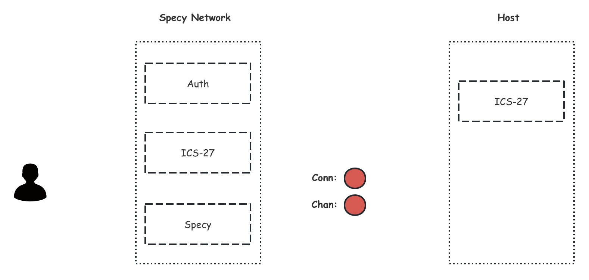
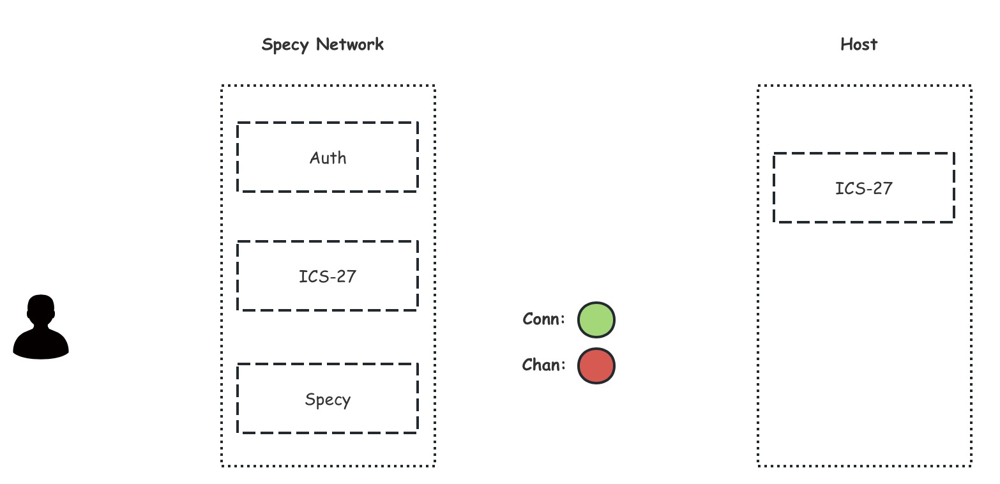
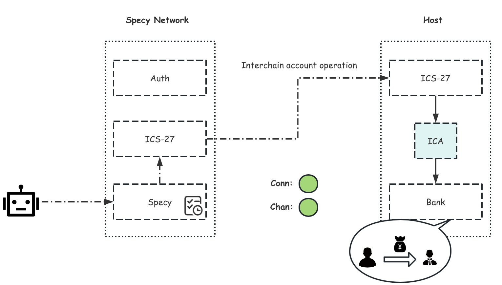

# Specy-Network

Specy Network is the automation engine of cosmos ecosystem

## Overview 

Specy Network is a cutting-edge layer-1 blockchain, powered by the Cosmos stack, purpose-built for seamless automation, enabling gasless and automated transaction flows across multiple blockchains of the Cosmos ecosystem.

With Specy Network, users can seamlessly execute their Dapp in the future based on predefined conditions using multi-chain data. For example, they can automatically update a Merkle root of a reward list daily, implement automated trading strategies that leverage both on-chain and off-chain data, and execute token transactions at optimal prices through automated buying and selling.

To meet these high expectations, Specy Network utilizes a trusted specification based on the domain-specific asset language (DSAL). This empowers developers to easily define task conditions and required outcomes using both on-chain and off-chain data. Moreover, the network ensures reliable task execution verification through computational proofs based on TEE signatures or zero-knowledge proofs (ZKPs).

### Developer Documentation

specy developer docs can be found on the Specy-network documentation website.

https://specy-network.github.io/

## Setup

1. Clone this repository and build the application binary

```bash
git clone https://github.com/specy-network/specy.git -b specy-2
cd specy

make install 
```

2. Download and install an IBC relayer. ([hermes](https://hermes.informal.systems/), [go relayer](https://github.com/cosmos/relayer) or both ) 
```bash
# hermes (make sure to use v1.0.0 or later)
cargo install ibc-relayer-cli --bin hermes --locked

or

# go relayer (make sure to use v2.0.0-rc4 or later!)
git clone https://github.com/cosmos/relayer.git
cd relayer 
make install
```

3. Bootstrap two chains, configure the relayer and create an IBC connection (on top of clients that are created as well)
```bash
# hermes
make init-hermes

or

# go relayer
make init-golang-rly
```

:warning: **NOTE:** When you want to use both relayers interchangeably, using both of these `make` commands will set up two seperate connections (which is not needed and can lead to confusion). In the case of using both relayers, perform:
```bash
make init-golang-rly
./network/hermes/restore-keys.sh
```

4. Start the relayer
```bash
#hermes
make start-hermes

#go relayer
make start-golang-rly
```

:exclamation: **NOTE:** It is abstracted away in the script files, but in case you want to manually run `rly start` with interchain accounts, you will need to add this flag: `-p events` to it.

> This is the situation *before* `make init-*`. The blockchains are not live yet.


> This is the situation *after* `make init-*`. The chain binary's have been built and started, and an IBC connection between controller and host chains has been set up.


## Demo

**NOTE:** For the purposes of this demo the setup scripts have been provided with a set of hardcoded mnemonics that generate deterministic wallet addresses used below.

```bash
# Store the following account addresses within the current shell env
export WALLET_1=$(specyd keys show wallet1 -a --keyring-backend test --home ./data/test-1) && echo $WALLET_1;
export WALLET_2=$(specyd keys show wallet2 -a --keyring-backend test --home ./data/test-1) && echo $WALLET_2;
export WALLET_3=$(specyd keys show wallet3 -a --keyring-backend test --home ./data/test-2) && echo $WALLET_3;
export WALLET_4=$(specyd keys show wallet4 -a --keyring-backend test --home ./data/test-2) && echo $WALLET_4;
```

### Registering an Interchain Account via IBC

Register an Interchain Account using the `intertx register` cmd. 
Here the message signer is used as the account owner.

```bash
# Register an interchain account on behalf of WALLET_1 where chain test-2 is the interchain accounts host
specyd tx intertx register --from $WALLET_1 --connection-id connection-0 --chain-id test-1 --home ./data/test-1 --node tcp://localhost:16657 --keyring-backend test -y

# Query the address of the interchain account
specyd query intertx interchainaccounts connection-0 $WALLET_1 --home ./data/test-1 --node tcp://localhost:16657

# Store the interchain account address by parsing the query result: cosmos1hd0f4u7zgptymmrn55h3hy20jv2u0ctdpq23cpe8m9pas8kzd87smtf8al
export ICA_ADDR=$(specyd query intertx interchainaccounts connection-0 $WALLET_1 --home ./data/test-1 --node tcp://localhost:16657 -o json | jq -r '.interchain_account_address') && echo $ICA_ADDR
```

> This is the situation after registering the ICA. A channel has been created and an ICA has been registered on the host.


#### Funding the Interchain Account wallet

Allocate funds to the new Interchain Account wallet by using the `bank send` cmd.
Note this is executed on the host chain to provide the account with an initial balance to execute transactions.

```bash
# Query the interchain account balance on the host chain. It should be empty.
specyd q bank balances $ICA_ADDR --chain-id test-2 --node tcp://localhost:26657

# Send funds to the interchain account.
specyd tx bank send $WALLET_3 $ICA_ADDR 10000stake --chain-id test-2 --home ./data/test-2 --node tcp://localhost:26657 --keyring-backend test -y

# Query the balance once again and observe the changes
specyd q bank balances $ICA_ADDR --chain-id test-2 --node tcp://localhost:26657
```

> This is the situation after funding the ICA.


#### Create automation transaction task
- Automation task case 1:

    Create a transfer task for the host chain on the controller chain. When the task is executed, the interchain account on the host chain will transfer to the specified address.

    //TODO Add explanation for rulefile！
```bash
specyd tx specy create-task \
    test_task connection-0 \
    '{
    "@type":"/cosmos.bank.v1beta1.MsgSend",
    "from_address":"cosmos1upfegaenhhvl8r4ezhe8zt6ez9r80pcxd8c9zfrjshskfxjdjypsutdwwc",
    "to_address":"cosmos10h9stc5v6ntgeygf5xf945njqq5h32r53uquvw",
    "amount": [
        {
            "denom": "stake",
            "amount": "1000"
        }
    ]
    }' rulefile 0 0 100 --from $WALLET_1 --chain-id test-1 --home ./data/test-1 --node tcp://localhost:16657 --keyring-backend test -y
```

- Automation task case 2:

    Create a pledge task on the target chain and trigger it when the target conditions are met.
```bash
specyd tx specy create-task \
    test_task1 connection-0 \
    '{
    "@type":"/cosmos.staking.v1beta1.MsgDelegate",
    "delegator_address":"cosmos1upfegaenhhvl8r4ezhe8zt6ez9r80pcxd8c9zfrjshskfxjdjypsutdwwc",
    "validator_address":"cosmosvaloper1qnk2n4nlkpw9xfqntladh74w6ujtulwnmxnh3k",
    "amount": {
        "denom": "stake",
        "amount": "1000"
    }
    }' rulefile 0 0 100 --from $WALLET_1 --chain-id test-1 --home ./data/test-1 --node tcp://localhost:16657 --keyring-backend test -y
```

Query task details

```bash 
specyd q specy list-task --node tcp://localhost:16657
```

#### Simulate task execution

Note：This is actually executed by the executor when the task rulefile setting is met.
```bash
specyd tx specy execute-task \
cosmos1m9l358xunhhwds0568za49mzhvuxx9uxre5tud test-task1 cproofstring performdataString \
--from $WALLET_1 --chain-id test-1 --home ./data/test-1 --node tcp://localhost:16657 --keyring-backend test -y
```



#### Query the execution results of automated tasks on the host chain

- staking detail
```bash
specyd q staking delegations-to cosmosvaloper1qnk2n4nlkpw9xfqntladh74w6ujtulwnmxnh3k --home ./data/test-2 --node tcp://localhost:26657
```
- account balance
```bash
specyd q bank balances $ICA_ADDR --chain-id test-2 --node tcp://localhost:26657
```

